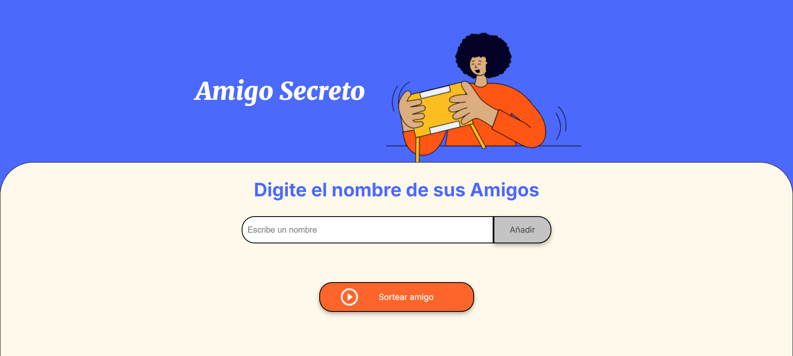
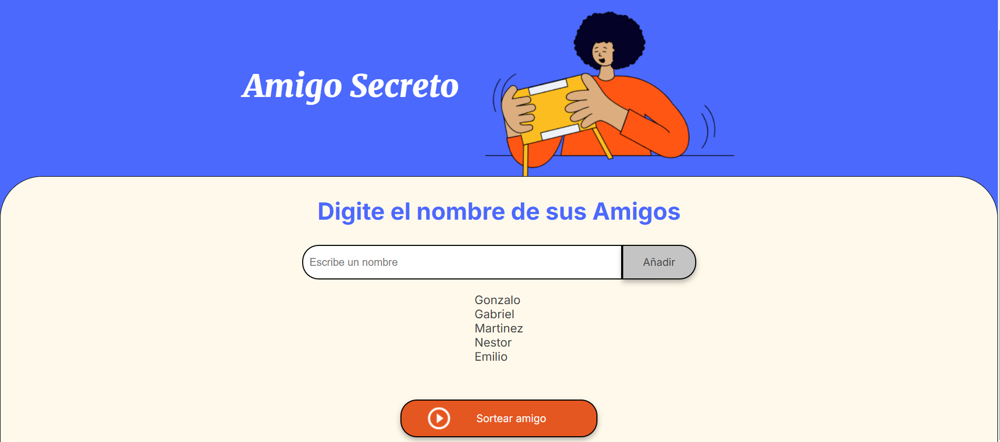
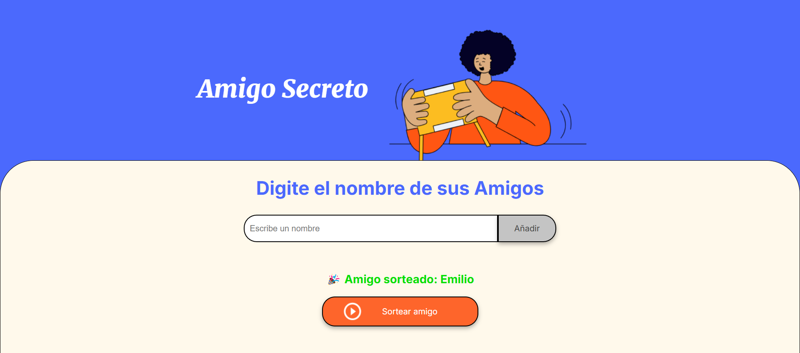

# Amigo Secreto

## Descripción

Amigo Secreto es una aplicación web interactiva que permite ingresar nombres de amigos, almacenarlos en una lista y luego realizar un sorteo para seleccionar a un amigo al azar. Después del sorteo, la lista se limpia automáticamente para permitir nuevos juegos.

## Funcionalidades

- **Agregar amigos**: Los usuarios pueden escribir nombres en un campo de entrada y agregarlos a una lista.
- **Validación de entrada**: Se verifica que el campo no esté vacío antes de agregar un nombre.
- **Mostrar lista de amigos**: La lista se actualiza dinámicamente al agregar nuevos amigos.
- **Sorteo aleatorio**: Se selecciona un nombre al azar utilizando `Math.random()` y `Math.floor()`.
- **Limpieza automática**: Después del sorteo, la lista de amigos se borra para iniciar un nuevo juego.

## Tecnologías utilizadas

- **HTML**
- **CSS** 
- **JavaScript**

## Instalación y uso

1. Descarga o clona este repositorio.
2. Abre el archivo `index.html` en tu navegador.
3. Ingresa nombres en el campo de texto y haz clic en **Agregar Amigo**.
4. Haz clic en **Sortear Amigo** para elegir un amigo al azar.
5. Después del sorteo, la lista se limpiará automáticamente para un nuevo juego.

## Capturas de pantalla

### Interfaz principal

### Lista de amigos

### Resultado del sorteo

## Autor

Desarrollado por Gonzalo